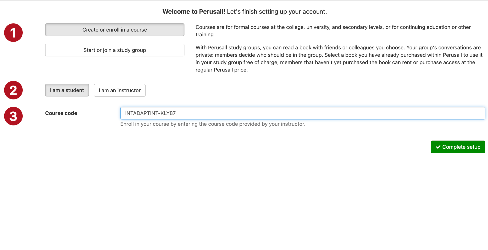
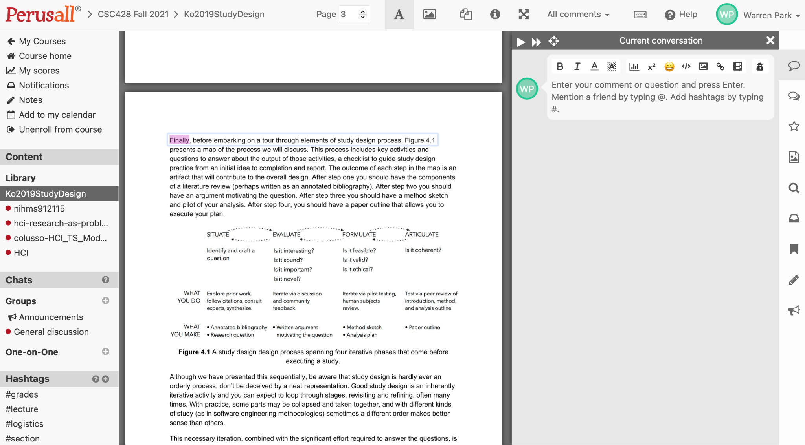
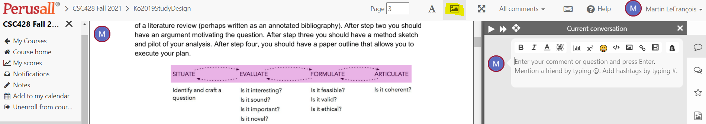
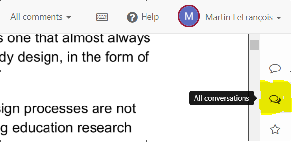

# How to use Perusall page for this course

*Taken from [this](https://docs.google.com/document/d/1sawfBJNJhdgIGh5k5DnylFIW1DxuqWLYRi4-S1Qam4c/edit?usp=sharing) page in the course folder compiled by Warren Park.*

1. Register on the Perusall website: (https://perusall.com)
2. Join this course via the course code: **INTADAPTINT-KLY87**

### How to do this?

After signing up, choose “create or enroll in a course” and then click “I am a student”. Then, copy and paste the course code into the text input, and click ”complete setup”.

## Perusall interaction tips

### Where to find papers?
All of the papers are listed on the library tab on the left-hand-side panel.

### How to add comments on a particular location on the document?

Highlight the words/sentences that you want to add a comment on, and start adding your comments in the form of “conversation”!

### How to add comments on an image

Click on the Annotate Figure button from the navigation bar at the top, then highlight any part of an image and add in your comments under Current conversation.

### How to see all comments in a documents

From the right vertical comment navigation bar, click the All Conversations button.

